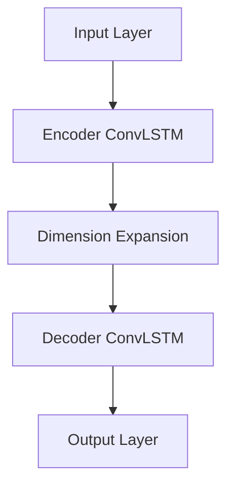
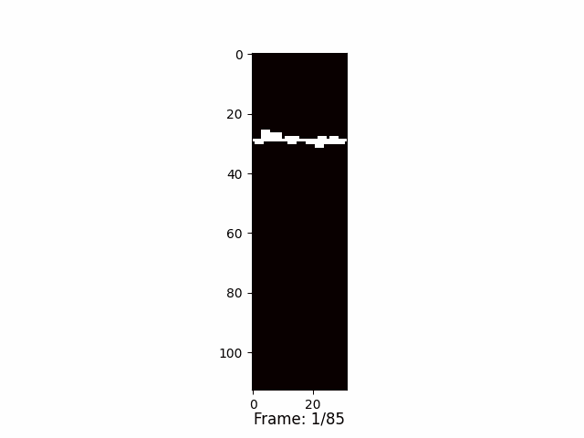

# 2024 Flame AI Challenge

## Getting Started

Explore the code directly in this repository under [
`2024 Flame AI Challenge | CONVLSTM.ipynb`](https://github.com/dipp-12/2024-flame-ai-challenge/blob/main/2024%20FLAME%20AI%20Challenge%20%7C%20CONVLSTM.ipynb)
or from the interactive notebook
on [Kaggle here](https://www.kaggle.com/code/muhammadnadhifn/2024-flame-ai-challenge-convlstm).

## Description

This repository provided my solution for the 2024 Flame AI Challenge hosted by [BLASTNet](https://blastnet.github.io/).
The Challenge was to develop a spatio-temporal ML model to forecast the fire propagation. The task is to create an
autoregressive ML model that learn fire line while considering the effects of terrain, atmospheric flow
conditions, and environmental interactions.

## Data

Data used on this challenge are extracted from a series of high-fidelity ensemble simulations that are the basis of the
Google FireBench dataset, which is a collection of high-resolution fire spread simulations. The data is available on
the [Google FireBench](https://sites.research.google/gr/wildfires/firebench/).

### Preprocessing

The data is processed to create a dataset which is composed of 5D with dimensions `(n, time, height, width, chanels)`,
where the channel are the following:

- xi_f: the fire line
- theta: the terrain elevation
- ustar: the wind speed
- uin: the wind direction
- alpha: the slope

Each channel normalized separately to values between 0 and 1. Then, the dataset windowed to create input and target for
forecasting. The input is a sequence of 5 frames and the target is the 20 frame.

## Modelling Approach

The model is structured in three main parts: an Encoder, a Dimension Expansion, and a Decoder. Here’s a quick overview
of the model:

### Encoder

The **Encoder** processes the input sequence and learns important patterns over time, turning it into a summary
representation of the data.

### Dimension Expansion

This part **expands** the time dimension of the encoded representation to align with the target output sequence length.
Given a 5-frame input and a 20-frame target, the Dimension Expansion step replicates the encoded features 4 times using `Repeat Vector`.

### Decoder

The **Decoder** takes the expanded data and generates a sequence of frames for the output. It uses similar layers as the
Encoder but works in reverse, aiming to reconstruct the original information in a new form.

## Results

Here is the prediction result consisting of 4 auto-regressive steps, including 5 input frames and 80 target frames. The
auto-regressive model take last 5 frames form the output and use it as input for the next prediction.

